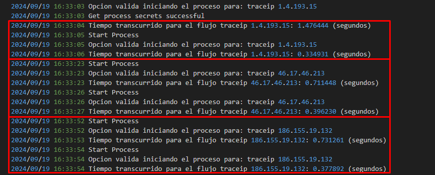
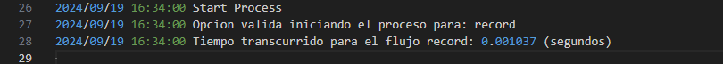
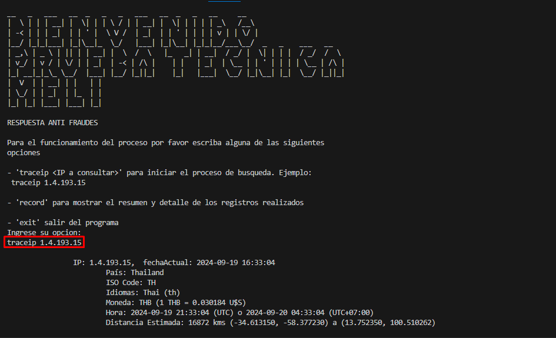
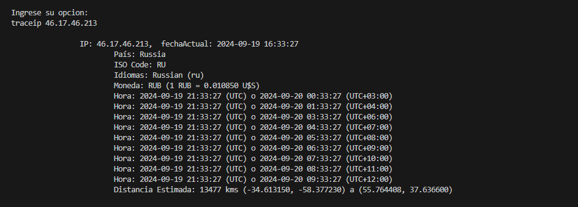
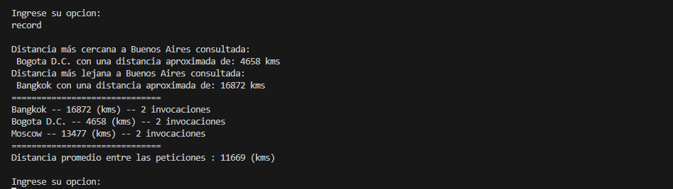

# Proyecto de Información Geográfica

Este proyecto proporciona funcionalidades para obtener información sobre direcciones IP, países y monedas a través de APIs externas. Incluye manejo de errores, almacenamiento en caché y registro de estadísticas.

## Tabla de Contenidos

- [Características](#características)
- [Estructura del Proyecto](#estructura-del-proyecto)
- [Instalación](#instalación)
- [Uso](#uso)
- [Contribución](#contribución)
- [Licencia](#licencia)

## Características

- Obtención de información geográfica basada en direcciones IP.
- Recuperación de datos de países, incluyendo idiomas y monedas.
- Consulta de tasas de cambio de monedas.
- Registro de estadísticas de invocaciones y distancias.


## Estructura del Proyecto


```
.
├── cms
│   └── command.go             # Ejecucion inicial para validar la entrada, arranque de servicios y ejecucion
├── interfaces
│   ├── secrets.go             # Interfaz que define el comportamiento de la obtencion de los secretos
│   ├── services.go            # Interfaz que define el comportamiento de la obtencion de informacion
│   └── store.go               # Interfaz que define la forma de almacenamiento de los datos
├── models
│   ├── countryapi.go          # Definicion de la estructura de la respuesta del servicio de region
│   ├── currencyapi.go         # Definicion de la estructura de la respuesta del servicio de monedas
│   ├── errors.go              # Definicion de los errores customizados para la aplicacion
│   ├── ipapi.go               # Definicion de la estructura de la respuesta del servicio de la ip
│   ├── response.go            # Definicion de la estructura de la respuesta del proceso 'traceip'
│   └── stats.go               # Definicion de la estructura de entrada y salida para la obtencion de estadisticas
├── services
│   ├── awssecrets.go          # Implementacion del manejo de los secretos
│   ├── datastore.go           # Implementacion de la implementacion de almacenamiento (capa de persistencia)
│   ├── information.go         # Implementacion de la logica de la obtencion de la informacion
│   └── stats.go               # Logica para la obtencion, formateo y calculo de estadisticas
├── utils
│   ├── log.go                 # Configuracion dellog
│   └── utils.go               # Funciones transversales y definicion de constantes
├── main.go                    # Punto de entrada del programa
└── go.mod                     # Archivo de módulos de Go
```


## Instalación

### Requisitos

- Go (versión 1.16 o superior)
- AWS SDK para Go

### Pasos

1. Clona el repositorio:
   git clone https://github.com/tu-usuario/tu-repositorio.git
   cd tu-repositorio

2. Instala las dependencias:
   go mod tidy

3. Configura tus credenciales de AWS para acceder a Secrets Manager si es necesario.

## Uso

Para ejecutar el programa, utiliza:

go run main.go

Asegúrate de que el código esté configurado para manejar las solicitudes adecuadas según la implementación.

### Use en docker

Para poder construir un contenedor con esta aplicacion es necesario que tengas configurado docker
y algun administrador de contenedores como docker-desktop

y ejecutar los siguientes comandos en la raiz donde se encuentra el archivo 'Dockerfile'

1. Crear la imagen a partir de la configuracion del Dockerfile y el codigo fuente:
 
docker build -t service_fraud .  

2. Crear un contenedor y ejecutar a partir de la imagen generada del paso anterior, Es importante indicar que la obtencion de las claves para el consumo de las api se realizan por medio en este caso se secrets manager por lo que es necesario configurar un usuario con permisos limitados para poder acceder a este servicio

docker run -it -e AWS_ACCESS_KEY_ID=valor1 -e AWS_SECRET_ACCESS_KEY=valor2 service_fraud

## Optimizaciones realizadas

1. Durante el proceso de obtencion de la informacion de la region y las monedas si responden satisfactoriamente, por medio de la implementacion de la interfaz 'store.go', se guarda la informacion en memoria de la region y la moneda por un lapso de 30 min (configurado por la varia TTL_IN_MINUTES), por lo que actua como una base de datos en memoria que con tiempo de expiracion para poder reducir el consumo de las peticiones y procesamiento.

Esto se traduce en que al momento de ejecutar el proceso y si existe una region ya consultada dentro del rango de tiempo podemos ver un tiempo reducido aproximadamente un ~77%, en caso de que la region sea nueva pero la informacion de las monedas aun es vigente (segundo y tercer caso) podemos ver una optimizacion de tiempo aproximada al ~50%



2. Para realizar el calculo de las metricas se realiza en otro hilo o en este caso bajo un goroutine, una vez que tenga la informacion para realizar el calculo el proceso para el calculo de estadisticas se realiza de manera concurente con dos propositos.

No ocupar tiempo para la respuesta del usuario 
Tener lo mas pronto que se pueda la informacion actualizada para cuando el usuario lo consulte

Al realizar esto y debido a que puede llegar a ser un proceso demandante sumado a que dicho proceso al ejecutarse varias veces tenemos que garantizar que no existan errores de concurrencia se definio realizarlo concurrentemente para poder realizar procesos y bloqueos sin afectar el rendimiento general

Al solicitar la informacion esta ya se encuentra lista por lo cual el tiempo necesario es tambien reducido



3. Gracias al primer punto y debido a que usamos api's externas limitamos las llamadas de los servicios al minimo y aprovechando mas la informacion de corta y media vida lo mas posible.

## Visualizacion de los registros

1. Opcion 'traceip'





2. Opcion 'record'



## Contribución

Si deseas contribuir al proyecto:

1. Haz un fork del repositorio.
2. Crea una rama para tu característica.
3. Realiza tus cambios y haz un commit.
4. Haz un push a tu rama.
5. Abre un Pull Request.

## Licencia

Este proyecto está bajo la Licencia MIT. Consulta el archivo LICENSE para más detalles.

